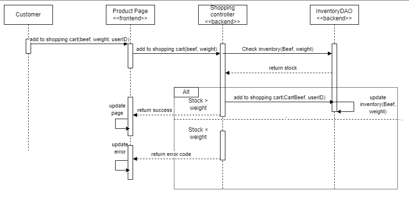
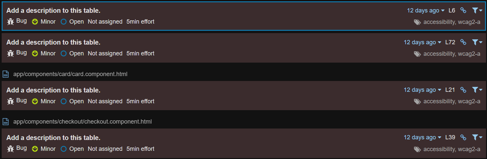

# PROJECT Design Documentation

## Team Information
* Team name: Cow Related Pun
* Team members
  * Brendan Battisti
  * Alice Cauchi
  * Brian McNulty
  * John West

## Executive Summary

Our application is an e-store for a butcher that provides a variety of cuts of beef of different grades, where the user can order these cuts by weight. The project front-end and back-end are developed using Angular, and Java, respectively.

### Purpose

The purpose of the application is for the butcher to sell partial or full cuts of beef to customers. The owner can create products of different prices and update weights as they receive more, and the customer can purchase these cuts with a credit card they have registered to their account.

### Glossary and Acronyms

| Term | Definition |
|------|------------|
|  SPA | Single Page |
| JSON | JavaScript Object Notation |
|  API | Application Programming Interface |
| HTML | Hyper-Text Markup Language |
|  CSS | Cascading Style Sheet | 
| MVVM | Model View ViewModel |
|  MVP | Minimum Viable Product |
|  DAO | Data Access Object |
|  UML | Unified Modeling Language | 

## Requirements

This section describes the features of the application.

- Users login via login page with their username and password
- Users logout via logout button
- Users are directed to featured products page upon sign in
- Users may create a new account from the new account page with a valid password
- Customers are able to browse and search catalog for beef
- Customers may click on beef to go to product page
- Customers may add beef to and view shopping cart
- Customers may add up to three valid credit cards
- Customers may remove credit cards via the account page
- Customers may reset their password via the account page
- Customers can checkout if they have an item in their cart and a credit card
- Customers may not checkout if they have an empty cart or lack a credit card
- Admins may add product images when creating beef
- Admins may not add beef to or view shopping cart
- Admins may add, remove, or update beef to inventory via admin dashboard
- Admins may not add or update beef fields to be negative on admin dashboard

### Definition of MVP

The MVP includes minimal user authentication for admins and users, with a reserved
admin account and other usernames being user accounts, the ability for customers to search
for products, add them to shopping carts, and proceed to checkout.It also includes the ability for admins to add, remove, and edit product data, such as beef fields and images.

### MVP Features

- Login Page
- New User Page
- Checkout Page
- Navigation Bar
- Create User File
- New Account Page
- Catalog Page
- Admin Dashboard
- Landing Page
- Product Page
- Shopping Cart
- Admin/Customer Authentication

### Enhancements

For our project we implemented the enhancements of password management and credit card storage. Password managment is a way that our users are able to create a password for their account and add an extra level of security. Within this, passwords must follow certain conventions. They must be 8-26 characters and can include letters, numbers, and some special characters. Users are also able to change their password through the user account page. The new password must also follow the same conventions and can be used immediatly after changing it. 

Credit card storage is the next enhancement in our project. We wanted the user to be able to store their card information, so they would not have to enter it every time. Customers can store up to 3 credit cards to their account. The cards must follow the 16 digit standard card number, a MM/YY expiration date, and a 3-4 number CVV. Customers can delete and add new cards however they like. A part of this enhancement is that during checkout, customers must choose a card to use as payment before checking out. Customers can keep track of their cards through their account page. Both of these enhancements are meant to improve the user experienc. 

## Application Domain

This section describes the application domain.

At the center of the domain model is the product entity, which represents beef. Beef is
contained in the inventory, and the admin adds different beef items as they become available.
These beef items are displayed on the catalog page for users to view and purchase, and users
are able to search by name or partial name in order to find the type of beef they want. Both
admins and customers are users that log in via the login page, which connects them to
the rest of the e-store. Customers have access to an Account page, where they can reset their password,
as well as add and remove credit cards for billing. Customers can then add products to their shopping cart.
Customers can then purchase their shopping cart at the checkout using one of the cards on file. 

## Architecture and Design

This section describes the application architecture.

### Summary

The following Tiers/Layers model shows a high-level view of the webapp's architecture.

The e-store web application, is built using the Model–View–ViewModel (MVVM) architecture pattern. 

The Model stores the application data objects including any functionality to provide persistance. 

The View is the client-side SPA built with Angular utilizing HTML, CSS and TypeScript. The ViewModel provides RESTful APIs to the client (View) as well as any logic required to manipulate the data objects from the Model.

Both the ViewModel and Model are built using Java and Spring Framework. Details of the components within these tiers are supplied below.

### Overview of User Interface

This section describes the web interface flow; this is how the user views and interacts
with the e-store application.

When not logged in, the user is first directed to featured products page. At the top of the screen, at this point in time,
there is no navigation bar, so the user must enter links to links to featured products page, catalog, shopping cart, login page, and admin dashboard.
The user is not able to access shopping cart if not signed in.
If the user is logged in, the login page is replaced with logout button, and they gain access to shopping cart. On the featured products page,
the user sees the 4 featured products, the price, and the weight available. The user can click on
a product to go to the product page. Alternatively, if the user goes to the catalog,
they may then type in part of a product name to search for the product, and then click on the desired
product to go to its product page. After going here, the user can add a quantity to their shopping cart via
a button. Admins have access to these features, but they may not add items to their shopping cart or view shopping cart
page, as they are redirected upon going to the page. Admins can navigate to ND,
where they see the product fields to add products. Any error messages from illegal operations are shown at the top of the screen. Below, each product and its fields are listed, with a textbox for editing the price and adding weight, and a button to delete the product.
> _Provide a summary of the application's user interface.  Describe, from
> the user's perspective, the flow of the pages in the web application._

### View Tier

Upon arriving at the home page, the user is presented with the three featured product cards. Each product card has the name of the product, an image (if present), and the available quantity of the product. Clicking on any of these products brings the user to the product page, where they can see a larger picture of the product and the same information as before. However, they are not able to add things to their shopping cart until they sign in or create a new account. To do so, they may click the button to go to either the login page or the new user page, and log into or create their account using a valid username and password. They may then return to the product page to add products to their shopping cart. Alternatively, the customer can search the catalog for a product with a specific name, and navigate to the right page from there. After the customer has all the products they need, they may proceed to their shopping cart via the navigation bar or the shopping cart button on their product page, where they can remove products that they do not need. However, they also need to add a credit card before they can checkout on the account page, which is accessible via the navigation bar. After selecting a cart and checking out, the customer's cart is emptied. The customer may also change their password on the account page. Neither the account page nor the shopping cart functionality is available to administrators. Instead, they can create and remove items via buttons on the admin dashboard, or update product images, prices, and weights accordingly.

Below is a sequence diagram for an customer adding an item to their shopping cart:

Below is a sequence diagram for an admin creating a new item using the admin dashboard:

### ViewModel Tier
> _**[Sprint 4]** Provide a summary of this tier of your architecture. This
> section will follow the same instructions that are given for the View
> Tier above._

> _At appropriate places as part of this narrative provide **one** or more updated and **properly labeled**
> static models (UML class diagrams) with some details such as critical attributes and methods._
> 

### Model Tier
._

The model tier consists of beef, shopping carts, and users, which may be
customers or administrators.
Customers have a shopping cart, that may contain zero or more products, whereas admins do not.
Shopping carts are represented by a class, with CartBeef representing Beef as an item in the shopping cart. Both users are identified by username.
Beef has an incrementing id as its identifier, and has a grade, cut, weight, and price.
Beef contains methods to add, get, delete, and get all beef objects, as well as updating the price and field of beef objects. Users can add items to their shopping cart field via
a method, but this method and attribute does not exist for administrators.
Within admin and customer classes, there exists a method to validate whether or not the use is an admin, which is used in the view tier
for the acceptance criteria. There are also methods to get users by username, and create adminis and customer if necessary from the backend.

## OO Design Principles

Single Responsibility:

In the sample UML snippet above, both the Beef class and the InventoryFileDAO class
have distinctly separate responsibilities. The Beef class handles the creation of Beef objects and
provides methods for accessing the attributes of a given Beef object, including the item id, the
cut, the grade, and the weight. The InventoryFileDAO class handles the sole responsibility of
adding, removing, and editing Beef objects from the inventory file, with various methods used to
get specific Beef objects from the file given the attributes of the beef. InventoryFileDAO makes
use of the methods found in Beef to handle the creation and deletion of Beef objects because it is
the responsibility of InventoryFileDAO to handle inventory file concurrency. It would be
possible to implement a nested class that served the same functionality in InventoryFileDAO for
these purposes, but isolating the classes by responsibility allows for future classes to make use of
the Beef class. Therefore, the separation of the Beef and InventoryFileDAO classes is
representative of the single responsibility principle. Our front end also follows single
responsibility by separating the responsibilities of each component and service as much as
possible. We use a singular logging service for managing all of the error logging for our
application. We also use separate services which correspond to each controller on our backend to
maintain our separation of responsibilities all the way through our application

Low Coupling: 

Low coupling already exists within the back-end systems of our e-store API code. Within
our four main classes so far, we have InventoryContoller, InventoryDAO, InventoryFileDAO
and Beef. Beef relies on none of the other components within the code, InventoryFileDAO and
InventoryDAO only rely on beef, and InventoryController relies on Beef and InventoryDAO.
Within the code base we have so far, since there is not much currently there, the only thing we
could think of that would improve the low coupling of our current four classes is by changing the
implementation of inventoryController to use a generic type and instantiating it by passing the
Beef type to it to reduce the dependance and increase the modularity of the class. The only issue
with this is it may be increasing the project complexity by unnecessarily adding more classes as
we would then have to make a second controller class to extend the generic one we have built
which would then rely on the generic class and beef and inventoryDAO which has even more
coupling than just using the current inventoryController class that’s implemented, however it still
gives more freedom with the genericController. Our application adheres to the low coupling
principle by keeping our components separated and independent of each other as much as
possible. This allows us to reuse these services and components throughout the application,
making expansion easier. On top of this, should we need to remove a feature in the future, it
would require minimal editing, keeping code clean and maintainable.

In regard to our domain model, our Customer and Administrator both inherit from the
User class, and while this may not be as low coupling as possible, it would violate DRY principle
to separate them entirely. Nothing else in our domain model will directly translate to classes so a
low coupling analysis of this would not be feasible.

Information Expert:

Information Expert refers to the design principle that decides where to delegate certain
responsibilities of classes. The idea behind it is that the methods and computed fields and such
should be organized along with where the relevant data for these methods and fields are. In the
project we have a beef class that does not have a name field but it does have a name that can be
derived from two of the fields within the class, concatenating the grade with the cut of meat.
Doing this outside of the class to compute the name would not follow the information expert
design principle, which is why instead we have a getName() that exists within the beef class that
instead computes the name of the beef by concatenating the two properties internally and then
returning the string. We also have similar methods for retrieving the cut, price, weight, and
grade, when the attributes are used for display on admin dashboard, product pages, and the home
page.

This principle is also upheld within the Shopping Cart class, as we can retrieve the
contents of the shopping cart using a method rather than searching from the list outside of the
class. Similarly, the CartBeef object also has methods to get the id and weight of a CartBeef
object within the shopping cart for later use on the front end.

The information expert principle is followed within both subclasses of User, Admin and
Customer. Both classes contain the username, with a related method to get the username for use
in front end when logging in the user and when displaying messages related to the user.

The information expert principle is also applied within the InventoryFileDAO class as it
contains a map of the current inventory, and while we are able to get that entire list we can also
use extra methods which are contained within the same class for more accessible options rather
than getting the list and searching it outside of the class. The methods within this class that most
fit the information expert principle are the findBeef and getBeef(id).

Due to the fact that the information expert is such an implementation level concept, we
do not have much code for me to recommend any new suggestions for at this time as we have
only implemented the create and get products for now. While we were able to look towards the
domain diagram for bits and pieces of information towards some of the other principles, this will
not apply to information expert as it looks more towards methods and class data rather than a
high level view of the classes that are presented within the domain model.

As for ideas later down the line of development when we hit the 10% feature we will
need to look closely into its application within the cow class. Things such as owner comparison
rather than just get owner and having to compare outside the class will be essential there.
Looking back at the beef class, we will consider adding a sellBy date and an information expert method would be checking if it is expired. We also adhere to the information expert principle. By
keeping our components and services focussed on their individual responsibilities. This creates a
guideline for us to separate our components and services, which helps us adhere to other design
principles. For instance, our user service only deals with users, and our beef service only deals
with beef. While these could easily be combined into a backend service, keeping them separate
keeps the code clean and organized.

Dependency Injection: 

Dependency Injection is used commonly in our application. It is used in the constructor
functions of the InventoryController and the InventoryFileDAO constructor. The
InventoryController is injected with an InventoryDAO object for inventory interfacing. The
InventoryFileDAO’s constructor is injected with an ObjectMapper object which controls the
conversion of Java objects into a JSON representation. These dependencies allow for a looser
coupling in the code. This way the InventoryFileDAO does not need to control any of the object
mapping, making the code easier to organize and maintain. The InventoryController also benefits
greatly from dependency injection as it reduces the responsibility of the class, once again leading
to more organized and maintainable code. Dependency injection is also used heavily on our front
end for allowing components to communicate with services. It allows components such as
new-user, login, and logout, to each have access to the userService service. This keeps our code
clean and separated from adhering to other design principles, and it makes code maintenance
easier.

## Static Code Analysis/Future Design Improvements

No bugs were discovered on the backend of the our estore application once we had completed sprint three.
The remaining issues noted by sonarQube came from improper return values and incorrect coding practices. There were 2 different instances where we should have been returning one value type, but were returning null.The other instance is us not overriding a equals method, which for our implementation was not really necessary.

The bugs from the frontend were only for adding description to tables that we had displayed on the site for accessability purposes.  This was not a primary concern for our team as we were not approaching this project with high accessibility in mind for these circumstances.  Fixing this issue would be ideal if released to a diverse group of people who require these annotations for tables.

There were a few types of code smells that were marked by sonarQube that were found in many different instances throughout our project, one example being the use of types in the angle brackets when creating ResponseEntity<> objects.  These were easily fixed by removing the static typing within the creation of the ResponseEntity objects.  Another repeated issue that was seen revolved around some of our function names beginning with capital letters instead of following proper camelCase form, another easy fix using VSCode to update all references for a fast refactor.

We had also introduced a bug in most of our classes neglecting to consider the creation of hashCode implementations when we overrode the equals method for our defined classes. This violates of the the Java Language Specification and noted in sonar rules RSPEC-1206.  This bug of course has been fixed in our sprint 3 release.

In terms of imporvement in regards to the issues listed by SonarQube, there is not much left to be completed.  When the code smell was virst visited we had 220 code smells and were able to quickly drop those down to three as seen in the graph below.

In terms of future design improvements, one area to look at is heightened security.  Currently our session management is done through cookies and requesting the client who they are logged in as.  A better method towards this would be giving them a temporary security token to identify themselves with that expires after a set amount of time or inactivity.  The backend does not require authentication in order to perform many of the tasks that are requested of it and would do well to have some security controls implemented like adding authorization headers.  Passwords are stored in plaintext and do not follow strong design principles.  A consideration to make here would be adding a slow hashing algorithm like Argon2 or Bcrypt and including a salt with the password when hashing to improve the security from database breaches and protect from rainbow table attacks.

With our data, the most important improvement that can be made is to switch to a proper database instead of using files for storage.  SQL-based or even document-based systems would be a large improvement in pretty much every way.  If this route is to be considered, the easiest upgrade would most likely be to a document-based service such as MongoDB, however for the best computational results a relational database such as MySQL or Oracle should be kept in mind.

## Testing

Acceptance testing was successful, excluding the checkout component. Improving
code coverage required changing various parts of our implementation due to inadequate
return types, but was ultimately successful at 93 percent.

### Acceptance Testing
At this current sprint, we have 68 stories in total. Out of these stories, 66 pass the acceptance test, and 2 fail. During acceptance testing we found that there is no error page that pops up when a customer tries to access a product that does not exist. This issue does not concern us much, as unless customers attempt to type in a product that does not exist into the URL, all products that are in and out of stock are shown. Another test that failed was that when the shopping cart is empty, the checkout button is greyed out. The reason this test failed was because we decided to go with another plan of action and make the button not show up at all. This is not really an issue, as it was a team decision that had the same concept that caused the failure. 

### Unit Testing and Code Coverage

Using mock objects, our team tested the mode, controller, and persistence
tiers. We achieved an overall code coverage of 92 percent. Given an average
of 90 percent was the goal for the overall average, we set a target for
90 percent minimum for each of these tiers, with the main estore-api folder and the estore-api products folder
being the exception at 88 percent. Overall, our unit testing for this
phase was cohesive.

The largest hit to our code coverage came from a single feature which was updating the user's password.  In UserFileDAO, UserController, and Uer the methods for this were entirely untested which brought their code coverage down a significant amount. The only other type of methods that has been untested are the hashcode functions for beef and cartbeef. For future releases, these methods should be fully covered and given a comprehensive set of unit tests going forward.

All the other reasons that code coverage was missed comes from missed branches that are seperate from the primary logic flow and mostly menial amount of the code.  Ideally, moving forward, most of the unit tests should be rewritten as classes had tests that were properly mocked out and isolated from dependencies.  This was handled well in ShoppingController and others should follow it as an example.