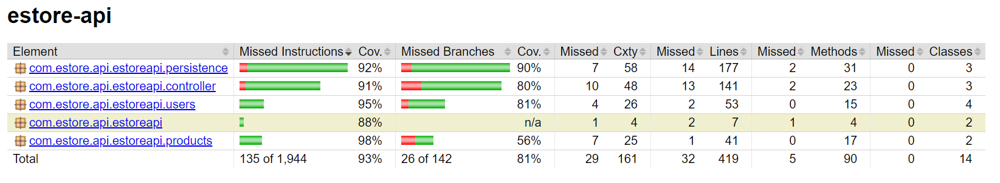

# Cow Related Pun Design Documentation

## Team Information
* Team name: Cow Related Pun
* Team members
  Brendan Battisti
  Alice Cauchi
  Brian McNulty
  John West

## Executive Summary

Our application is an e-store for a butcher that provides a variety of cuts of beef of different grades,
as well as the ability to sponsor and reserve different cuts from cows.

### Purpose

Our purpose is to facilitate the browsing and purchase of locally sourced beef between a butcher
and customers, and to provide the butcher with a portal to create and list items as they become available.

### Glossary and Acronyms

| Term | Definition |
|------|------------|
|  CT  | Catalog    |
|  LB  | Logout button |
|  LP  | Login Page |
|  FPP | Featured Products Page |
|  SC  | Shopping Cart |
|  SPA | Single Page |
|  INV | Inventory |
|  AD  | Admin Dashboard |
|  PP  | Product Page |

## Requirements

This section describes the features of the application.

- Users login via LP
- Users logout via LB
- Users are directed to FPP upon sign in
- Customers are able to browse and search CT for beef
- Customers may click on beef to go to PP
- Customers may add beef to and view SC
- Admins may not add beef to or view SC
- Admins may add, remove, or update beef to INV via AD
- Admins may not add or update beef fields to be negative on AD

### Definition of MVP

 The MVP includes minimal user authentication for admins and users, with a reserved
 admin account and other usernames being user accounts, the ability for customers to search
 for products and add them to shopping carts, and the ability for admins to add, remove, and
 edit product data.

### MVP Features

- Create User File
- New Account Page
- Catalog Page
- Admin Dashboard
- Landing Page
- Product Page
- Navigation Bar Component
- Shopping Cart
- Admin/Customer Authentication

### Roadmap of Enhancements

- Sponsoring a Cow
- Password Management
- Password Security

## Application Domain

This section describes the application domain.

At the center of the domain model is the product entity, which represents beef. Beef is
contained in the inventory, and the admin adds different beef items as they become available.
These beef items are displayed on the catalog page for users to view and purchase, and users
are able to search by name or partial name in order to find the type of beef they want. Both
admins and customers are users that log in via the login page, which connects them to
the rest of the e-store. Customers can then add products to their shopping cart. Customers
can then purchase their shopping cart as an order, which is then displayed as a receipt for the
customer to reference their purchase.

## Architecture and Design

This section describes the application architecture.

### Summary

The following Tiers/Layers model shows a high-level view of the webapp's architecture.

The e-store web application, is built using the Model–View–ViewModel (MVVM) architecture pattern. 

The Model stores the application data objects including any functionality to provide persistance. 

The View is the client-side SPA built with Angular utilizing HTML, CSS and TypeScript. The ViewModel provides RESTful APIs to the client (View) as well as any logic required to manipulate the data objects from the Model.

Both the ViewModel and Model are built using Java and Spring Framework. Details of the components within these tiers are supplied below.

### Overview of User Interface

This section describes the web interface flow; this is how the user views and interacts
with the e-store application.

When not logged in, the user is first directed to FPP. At the top of the screen, at this point in time,
there is no navigation bar, so the user must enter links to links to FPP, CT, SC, LP, and AD.
The user is not able to access SC if not signed in.
If the user is logged in, the LP is replaced with LB, and they gain access to SC. On the FPP,
the user sees the 4 featured products, the price, and the weight available. The user can click on
a product to go to the PP. Alternatively, if the user goes to the catalog,
they may then type in part of a product name to search for the product, and then click on the desired
product to go to its PP. After going here, the user can add a quantity to their SC via
a button. Admins have access to these features, but they may not add items to their SC or view SC
page, as they are redirected upon going to the page. Admins can navigate to ND,
where they see the product fields to add products. Any error messages from illegal operations are shown at the top of the screen. Below, each product and its fields are listed, with a textbox for editing the price and adding weight, and a button to delete the product.

### View Tier

When the estore goes online, the user and the admins view the landing page that holds the feature products and the navbar, which will be on every page. 
This is controlled by the home-page and nav-bar components. 
From there the users are able to see the log-in page and log-in with their respective username, which is controlled by the login component. Both users, customers and admins, will be redirected to the landing page after log in. 
Both admin and customers can view the catalog and product details that are controlled via the product-details and catalog components. 
From there the admin can view the inventory in the admin dashboard, via the admin-dashboard component. 
Because the admin has no access to a shopping cart, if the admin were to try and access a shopping cart, they will also be redirected to the admin dashboard. 
Customers cannot access the admin dashboard, but they do have access to the shopping cart and checkout. 
The view of the shopping cart is controlled by the cart compononent. 
Once a customer is done shopping and the admin is finished, they can log out view the log out compononent.  

### ViewModel Tier

The services that are critical for the data use are beef-service, which contains the information that the front end needs to display the product details for the admin and the customer. It allows the admins to create and edit products and for the front end to access that information. The userAuthService and the userService, are critical to the front end for making sure that users are seeing the appropriate pages depending on whether they are customer or admin. These services hold this data which determines the direction that the front-end will go. The cartService uses the current logged in user to allow the back-end data to interact with the front end of the shopping carts. 

### Model Tier
The model tier consists of beef, shopping carts, and users, which may be
customers or administrators.
Customers have a shopping cart, that may contain zero or more products, whereas admins do not.
Shopping carts are represented by a class, with CartBeef representing Beef as an item in the shopping cart. Both users are identified by username.
Beef has an incrementing id as its identifier, and has a grade, cut, weight, and price.
Beef contains methods to add, get, delete, and get all beef objects, as well as updating the price and field of beef objects. Users can add items to their shopping cart field via
a method, but this method and attribute does not exist for administrators.
Within admin and customer classes, there exists a method to validate whether or not the use is an admin, which is used in the view tier
for the acceptance criteria. There are also methods to get users by username, and create adminis and customer if necessary from the backend.

### Static Code Analysis/Design Improvements

Should the project be continued, we will need to implement the CSS to make the pages look nicer.
In addition, we will also need to implement the checkout page and receipt functionality to meet
the requirements of the domain model. We need to improve our unit testing moving forward to be
more cohesive and complete, and we also need to make sure all code adheres to the Java Style Guidelines
moving forward.

## Testing

Acceptance testing was successful, excluding the checkout component. Improving
code coverage required changing various parts of our implementation due to inadequate
return types, but was ultimately successful at 93 percent.

### Acceptance Testing

The number of user stories that passed all criteria is 10.

The number of stories that have failed all acceptance testing is 2,
both of these stories are related to the checkout feature, which was
not implemented due to time constraints.

There is one story that does not currently meet all of its acceptance criteria, and it
is the navigation bar. The navigation bar is not a part for the MVP for this particular
sprint, so it was not the primary focus of the team. A fair amount of criteria
was created with designing the CSS for this component in mind and was not really necessary
for this sprint, and other stories of greater importance were prioritized.

### Unit Testing and Code Coverage

Using mock objects, our team tested the mode, controller, and persistence
tiers. We achieved an overall code coverage of 93 percent. Given an average
of 90 percent was the goal for the overall average, we set a target for
90 percent minimum for each of these tiers, with the main estore-api folder
being the exception at 88 percent. Overall, our unit testing for this
phase was cohesive.